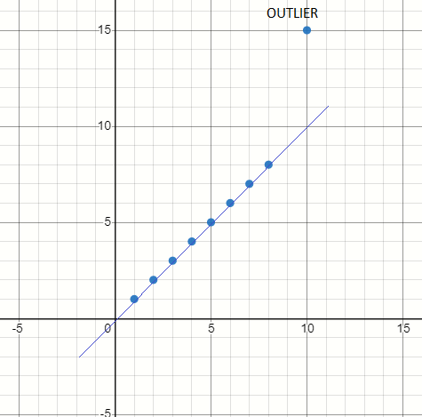

# Introduction

The RANSAC (Random sample and consensus) algorithm is the "gold standard" in eliminating noise. A while ago, I wrote an [article](https://medium.com/@saurabh.dasgupta1/outlier-detection-using-the-ransac-algorithm-de52670adb4a)  on how the RANSAC algorithm is implemented for finding the model of a straight line in a noisy field of points. 

In this article, I will explore how to implement the RANSAC algorithm a circle model in a noisy set of points.

# Problem definition

<<show a picture with dots arranged in a circle, show some noisy points, show the outcome when a little bit of noise is added>>

# Understanding the RANSAC algorithm for fitting a circle

<<you will need some diagrams to explain how the algo works, show 3 points, fit a circle, how many outliers>>

# Formal definition of the RANSAC algorithm
<<write the algo in a formal language, wee Wikipedia >>

# Overview of the source code

# Reference
- Youtube lecture (https://www.youtube.com/watch?v=BpOKB3OzQBQ)
- Wikipedia article on RANSAC (https://en.wikipedia.org/wiki/Random_sample_consensus)
- Finding the maxima and minima (http://clas.sa.ucsb.edu/staff/lee/Max%20and%20Min's.htm)

