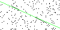
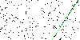

# Introduction
In this article we will explore the **Random Sample Consensus** algorithm - more popularly known by the acronym RANSAC. This is an iterative and a non-deterministic algorithm that helps in eliminating outliers. This algorithm is commonly used  to solve computer vision challenges. In this article I have presented the motivation for the RANSAC algorithm and the source code for a simplistic implementation using **Python**.

# Problem definition
Consider the distribution of points in the following diagram. 

The human mind can immediately spot that all the points in this distribution but for one is aligned in a straight line and the mind has no difficulty in distinguishing the inliers from the outliers. How can me make the computer emulate this aspect of the human behavior? The RANSAC algorithm attempts to address this challenge.

# Traditional approach - Fitting a straight line using the least squares regression method

Consider the points above. How do we find a line which fits this distribution? One of the popular approaches is the least square distance method. In this approach we 

- Create a cost function which sum up the distance of all points from the line
- Iteratively tinker with the equation of the line and evaluate the cost function
- Select the line line which yields the lowest cost function

## How do we build a cost function?

- Consider any point **Pi** with coordinates **(Xi, Yi)**
- Consider a straight line with the equation y=mx+c where  **m** is the slope and the **c** is the Y-intercept 

- The distance of P from the point where the vertical projection intersects this line is given by  **di=(mxi+c) - yi**
- We do want to be worried about negative values. Therfore let us square the above distance. di2=((mxi+c) - yi)2
- The summation of the square of the vertical distance of all **N** points is given by **Sum =&Sigma;(mxi+c) - yi)2**
- We can express the summationi as a function which is dependent on two variables - The slope **m** and the Y intercept **c**
- The cost function **f(m,c)** can now be expressed as **&Sigma;(mxi+c) - yi)2**
- Since we have 2 variables (m and c) we need 2 equations.
- The maxima/minima of a function can be determined by using derivatives. The point where a function achieves maxima/minima the derivative of the function at that point is zero.
- We will use partial differentiation to find the values of **m** and **c** which yield the lowest value
- The partial derivatives of f(m,c) with respect to the variables m and c would have to be zero to give us the lowest cost value
- df&frasl;dm = 2&Sigma;(mxi+c) - yi)*xi
- df&frasl;dc = 2&Sigma;(mxi+c) - yi)
- In the interest of time, I will skip the derivation of the least squares distance formula and straight away present the solution
- m=(N&Sigma;(xy) -&Sigma;x&Sigma;y)/(N&Sigma;(x2) + (&Sigma;x)2)
- c= (&Sigma;y - m&Sigma;x)/N

# Challenges with least squares regression 
## Scenario - No noise
Consider the data points shown below. The data appears to follow a straight line and indeed least squares regression gives us a nice line that models the data.

## Scenario - A few noisy data points
But real data is seldom so clean. Let us add one outlier to this distribution  (10,15) and find the best fitting line using least squares regression

We can see that the single outlier has brought about a considerable change. The out of box least squares method is very sensitive to outliers. 
- Algorithms like weighted least squares use the distance of a point from the straight line as a weight to minimize the impact of far flung points. 
- In this article we will restrict ourselves to RANSAC algorithm.

# Understanding RANSAC - Overview
Before getting into the full details, I have presented a distilled version of RANSAC in this section
- Randomly select a smaller set of points (**n**) from the entire distribution (**N**)
- Use least squares regression to determine the linear equation which fits the **n** points
- Determine the average of the distance of every point **N** from this line. This score can be considered to be a measure of the goodness of the line. 
- Keep track of the **score**. If this score is less than the best score obtained from previous iterations then discard the older linear equation and select the current linear equation.
- Go back the first step and continue iterating till you have completed a predetermined number of iterations
- Stop the algorithm when a predetermined number of iterations have been completed
- The linear equation available at the end of the iterations is possibly the best candidate line

We can see that the algorithm is not deterministic and hence the name *Random* in the acronym RANSAC. It is possible that you may not get the best model.

# Understanding RANSAC - Detailed
In this section I have presented the algorithm from the Wikipedia page of RANSAC
1. **MAX** = max iterations
1. **n**= number of points to pick in every iteration. Could be initialized to 2
1. **best_model** = equation of the line with best_error . Initialize to NULL
1. **best_error**= The lowest error (average distance) obtained so far. Initialize to a large number
1. **threshold_error**=if the distance of a point from a line is below this value then the point is classified as an inlier otherwise outlier
1. **threshold_inliers**=minimum number of inliers for a model to be selected
1. **k**= count of iterations completed. Initialize to 0
## Start
- **k**=**k** + 1
- if **(k > MAX)** then stop the algorithm
- select **n** random points from entire population. Denote this set by **random_points**
- Use least square regression to find the line  which fits **random_points**. Denote this equation by **current_model**
- Determine **inliers** which is the set of all the points within **threshold_inliers** distance of **current_model**
- **count_of_inliers** =count of points in the **inliers**
- if **count_of_inliers** is less than **threshold_inliers** then abandon this sample and go to **Start**
- Extend the sample by combining **inliers** and **random_points**. 
- Use least squares regression to find the line which fits **inliers** and **random_points**. This equation is denoted as **better_model** 
- Determine the average distance of all points from **better_model**. This is denoted by **current_error**
- if (**current_error** > **best_error**) then go to **Start**
- **best_model**=**current_model**
- **best_error**=**current_error**
- Go to **Start**
## End

# Results

## Test 1

### Input

### Result

## Test 2

### Input

### Result

## Test 3

### Input

### Result

# Overview of the code (TODO)
This is the body ddkkd

# References and further reading
- Youtube lecture (https://www.youtube.com/watch?v=BpOKB3OzQBQ)
- Wikipedia article on RANSAC (https://en.wikipedia.org/wiki/Random_sample_consensus)
- Deriving the least squares regression (https://online.stat.psu.edu/stat414/node/278/)
- Weighted least squares (https://towardsdatascience.com/when-and-how-to-use-weighted-least-squares-wls-models-a68808b1a89d)
- Hough transform (https://en.wikipedia.org/wiki/Hough_transform)
- Finding the maxima and minima (http://clas.sa.ucsb.edu/staff/lee/Max%20and%20Min's.htm)
