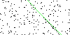
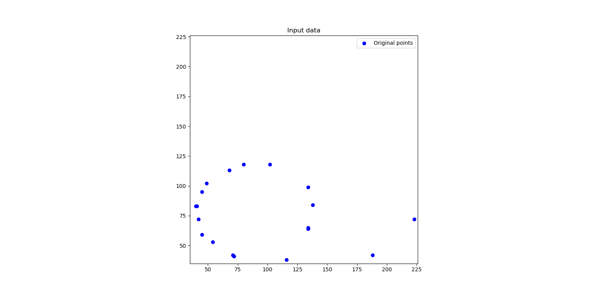
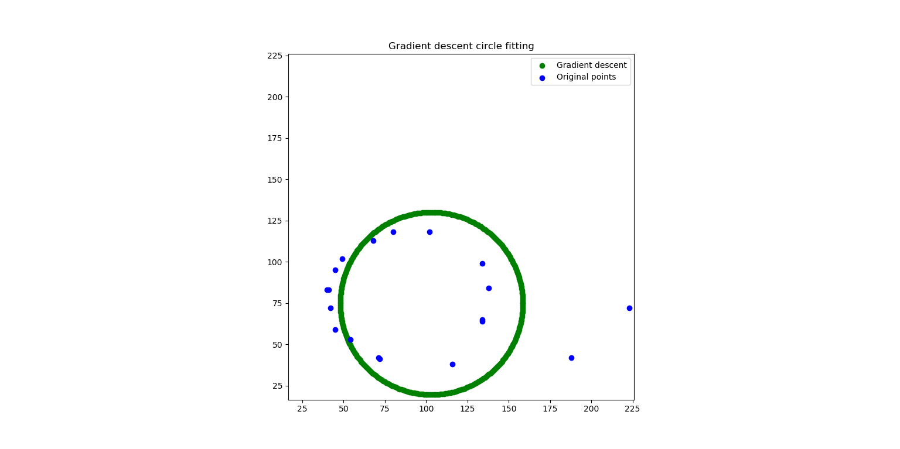
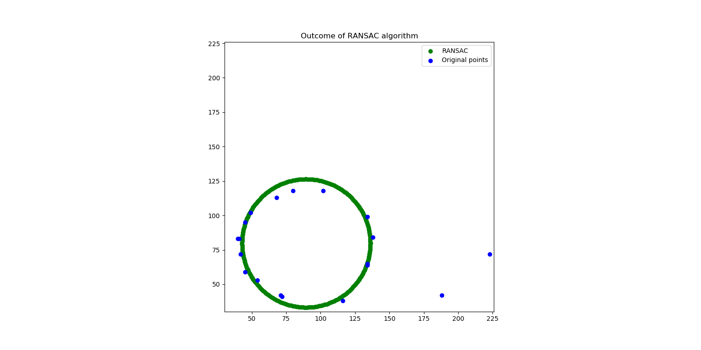

# Implementation of RANSAC algorithm for Lines and Circles
In this project I have demonstrated how to implement the RANSAC algorithm for Lines and then extended the principles and done an implementation for Circles

# Article on Medium
https://medium.com/@saurabh.dasgupta1/outlier-detection-using-the-ransac-algorithm-de52670adb4a

# About the source code
I have used the following tools to author the Python scripts that accompany this article.
1. Visual Studio 2019
1. with Python project templates
1. Python 3.7 engine

# Quick start
## Generating an image of a noisy line
- Run the script **GenerateNoisyLine.py** to generate a rectangular image with 1 line in a random orientation and salt-pepper noise
- The resulting image will be generated in the subfolder **.\out**

## Perform RANSAC on a noisy image
- Run the script **RANSAC.py** to find the best fitting line in a noisy image
- The input file is controlled by a variable inside RANSAC.py and the this file should be placed in the subdirectory **.\input**
- The output is generated in the form of a new image which has the RANSAC line superimposed over the original line

# Examples of noisy image 

## Random line with all points on the line and a background of salt-pepper noise

## Random line with points generated using Gaussian distribution and a background of salt-pepper noise

# List of Python files and folders

The folder hierarchy is as follows:
## **Algorithm** - Implementation of RANSAC alogrithm
- **RansacLineHelper.py** - RANSAC algorithm implementation for Line
- **RansacCircleHelper.py** - RANSAC algorithm implementation for of Circle

## **Common** - Python module files
- **LineModel.py** - Implements a class that represents the equation of a straight line in ax+by+c=0
- **CircleModel.py** - Implements a class that represents the a Circle given the center and a radius
- **Point.py** - Implements a class which represents a 2d point
- **RansacHelper.py** - Implements the core RANSAC algorithm
- **Util.py** - Utility functions

## **RANSAC** - Runnable python files which reference the module files in *Common*
- **ExecRANSACLine.py** - Outermost Python script which can be executed from the command line
- **ExecRANSACCircle.py** - Outermost Python script which can be executed from the command line
- **GenerateNoisyLine.py** - Outermost Python script which will generate a random straight line with salt-pepper noise
- **GenerateNoisyCircle.py** - Outermost Python script which will generate a random arc of a circle with salt-pepper noise
- **GenerateNoisyLineGaussian.py** - Outermost Python script which will generate a random line with Gaussian noise around the line on a background with salt-pepper noise
- .\input\ - The folder containing input files
- .\output\ - The folder where the resulting images are published

## **UnitTests** 
- **test_??.py** - These are unit test classes for all the algorithms

## Configuring the Python environment
If you are using Visual Studio 2019 as your Python IDE then you can configure the project properties of *RANSAC* and specify the *Search path* property
For other environments, the PYTHONPATH environment variable should be set to the physical location of *Common* folder

# RANSAC for Circle

## Data points
Notice the outliers on the bottom right of the image

## Outcome of Gradient descent
The algorithm is agnostic of outliers and hence the circle is skewed towards the right

## Outcome of RANSAC
Notice how the algorithm has eliminated the outliers and found a nice fitting circle

# RANSAC implementation for Circles - Areas for improvement
RANSAC for straight lines relies on least squares algorithm to find the line which fits a set of points.
When I started implementing RANSAC for circles, I was unsure of what would be the best mathematical approach to fit a circle to a set of points.
Unlike the least squares method for lines, the equivalent approach for circles is non-linear and hard to solve without an interative approach
I used the Gradient Descent Approach and this worked well. However, GD is an iterative approach and fairly expense. 
In the later stages I learnt of Randy Bullock's approach which reduces the non-learn optimization problem to a liner problem

# References and further reading
- Wikipedia article on RANSAC (https://en.wikipedia.org/wiki/Random_sample_consensus)
- Youtube lecture (https://www.youtube.com/watch?v=BpOKB3OzQBQ)
- Deriving the least squares regression (https://online.stat.psu.edu/stat414/node/278/)
- Weighted least squares (https://towardsdatascience.com/when-and-how-to-use-weighted-least-squares-wls-models-a68808b1a89d)
- Hough transform (https://en.wikipedia.org/wiki/Hough_transform)
- Finding the maxima and minima (http://clas.sa.ucsb.edu/staff/lee/Max%20and%20Min's.htm)
- Overview of various circle fitting algorithm (https://arxiv.org/pdf/cs/0301001.pdf)
- Least squares circle fitting algorithm by Randy Bullock (http://www.dtcenter.org/sites/default/files/community-code/met/docs/write-ups/circle_fit.pdf) 
- 